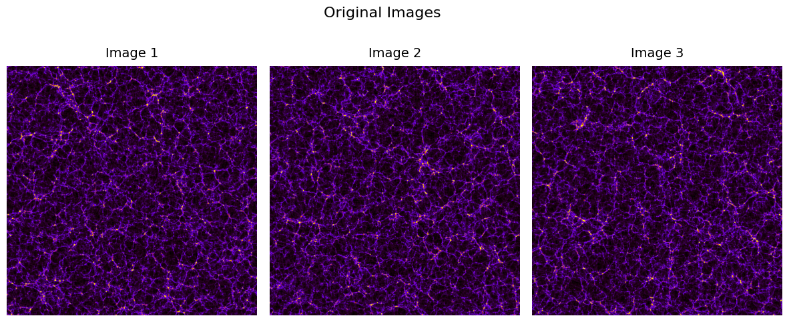
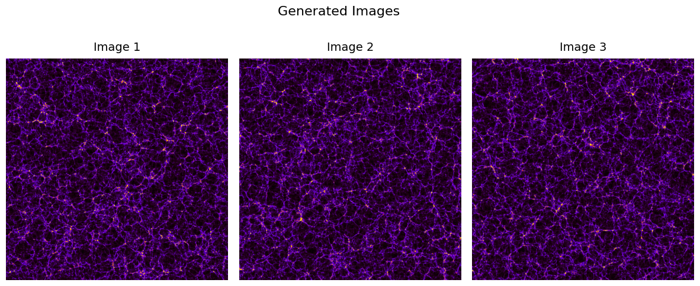
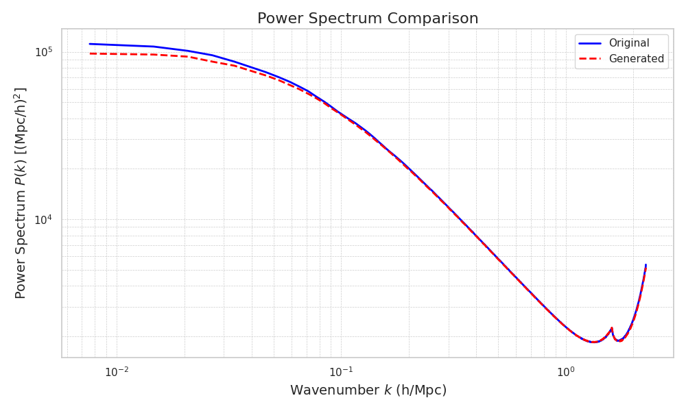
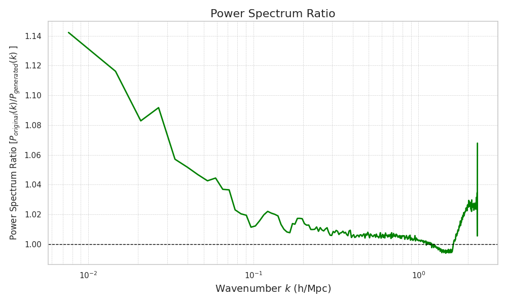
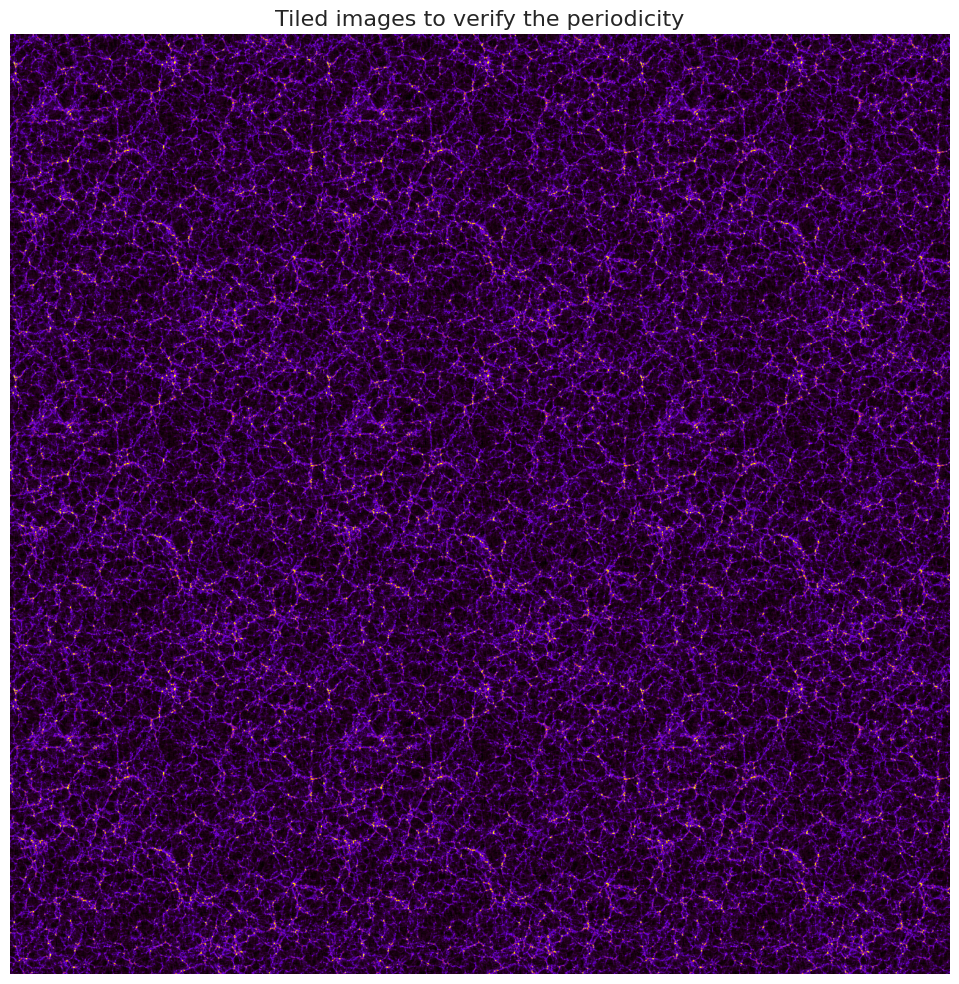

# Cosmology Simulations with Generative AI

This repository explores the use of Generative AI models to replicate cosmology simulation data, aiming to significantly reduce the time required for prototyping and parameter estimation.

## Introduction

Cosmology simulations traditionally require extensive computational resources, often taking hours or even thousands of core hours. Our goal is to accelerate this process by leveraging Generative AI to create data that closely resembles the output of traditional simulations. By preserving the underlying constraints and structures, we aim to provide a faster and more efficient method for estimating cosmological parameters.

## Dataset

We utilized the [Quijote Simulations dataset](TODO: Add reference) to train Generative AI models. Below is an example of the plotted data for visualization:

## Approach

To achieve our goal, we explored various Generative AI models:

- **DiT (Diffusion Transformers)**: Effective in capturing complex data distributions but may require more data for optimal performance.
- **DDPM (Denoising Diffusion Probabilistic Models)**: A generative model that leverages diffusion processes to generate high-quality data. It performed exceptionally well with our smaller dataset of approximately 9000 samples.

While Transformer models (DiT) showed good data representation, the DDPM model demonstrated superior performance for our dataset size, providing more accurate and reliable generated data.

Below are examples of images generated by DDPM models:

Visually, it's challenging to distinguish between the original and generated images.

## Evaluation

To evaluate the quality of the generated data, we performed power spectrum analysis to compare it with the original simulated data. We used the Mean Absolute Fractional Difference (MAFD) of the power spectrum as our evaluation metric, which measures the discrepancy between the generated and actual data. Our results yielded an MAFD of 1.10%, indicating high fidelity in the generated simulations.

The power spectrum comparison plot is shown below:

The analysis shows good agreement except for low wavenumbers (k), which correspond to the large-scale structures in the images. This discrepancy could be attributed to sampling effects. 

For a clearer understanding, we plotted the ratio of the power spectrum of original to generated images, which reveals residuals for each wavenumber \(k\):

## Periodic Boundary Conditions (PBCs)

Since the Quijote simulations obey Periodic Boundary Conditions (PBCs), it is essential to verify that the generated data also adheres to these conditions. We performed a visual inspection by stacking a generated image in a 3x3 grid. The following image demonstrates that the generated data obeys PBCs perfectly:

## References

- [Denoising Diffusion Pytorch](https://github.com/lucidrains/denoising-diffusion-pytorch)

TODO List: 
  - Complete all other references
  - add requirements.txt
  - talk about the training, architecture and model parameters
  - Calculate FID and sFID

